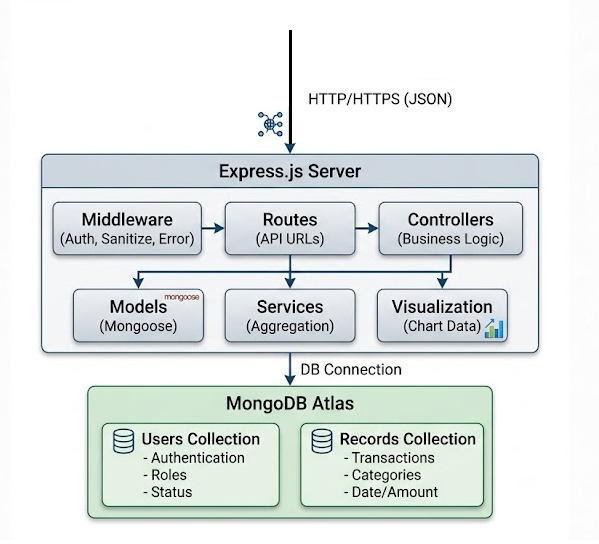
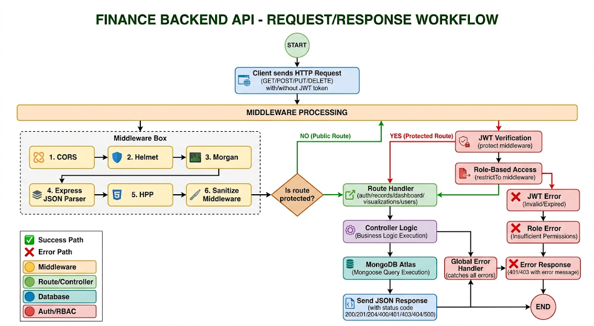

## 📖 FINAL PROFESSIONAL README.md (Good to Go!)

---

## 🌐 Live Demo

| Environment        | URL                                                        |
| ------------------ | ---------------------------------------------------------- |
| **Production API** | https://zorvyn-backend-assessment-u56z.onrender.com        |
| **Health Check**   | https://zorvyn-backend-assessment-u56z.onrender.com/health |
| **API Base URL**   | https://zorvyn-backend-assessment-u56z.onrender.com/api/v1 |

> ⚠️ **Note:** Render free tier sleeps after 15 minutes of inactivity. First request may take 30-50 seconds to wake up.

---

## 📋 Overview

A production-ready RESTful API for a Business/Organizational Finance Dashboard system built with Node.js, Express, and MongoDB.

This backend enables small to medium businesses to track income/expenses, generate analytics, visualize financial data, and enforce role-based access control across multiple users (Admin, Analyst, Viewer).

While the architecture supports personal finance use cases, it is specifically designed for business scenarios where different team members need different levels of access to financial records.

Key capabilities include: JWT authentication, role-based permissions, complete CRUD operations, advanced filtering with search and pagination, dashboard analytics, and 7 chart-ready visualization endpoints.

### 🎯 Key Capabilities

| Capability                    | Description                                            |
| ----------------------------- | ------------------------------------------------------ |
| 🔐 **Authentication**         | JWT-based secure authentication                        |
| 👥 **Role Management**        | Admin, Analyst, Viewer roles with granular permissions |
| 💰 **Transaction Management** | Complete CRUD for income/expense records               |
| 🔍 **Advanced Filtering**     | Search, pagination, date ranges, categories            |
| 📊 **Dashboard Analytics**    | Real-time financial summaries and insights             |
| 📈 **Visualization APIs**     | 7+ chart-ready endpoints (bar, pie, line, area, etc.)  |
| 🛡️ **Security**               | Helmet, CORS, input sanitization, password hashing     |

---

## 🏗️ System Architecture

### High Level Backend Architecture



_The backend follows a clean MVC architecture with Express.js handling routes, controllers processing business logic, and MongoDB for data persistence._

### Backend API Workflow Architecture



_Complete request-response cycle showing authentication middleware, role-based access control, and data flow from client to database._

### Architecture Flow Explanation

```

Client Request → Authentication Middleware → Role-Based Access Control →
Controller → Service Layer → Database → Response → Client

```

---

## 🚀 Quick Start

### Prerequisites

```bash
Node.js 18+
MongoDB Atlas account (or local MongoDB)  url
npm or yarn
```

### Installation (5 minutes)

```bash
# 1. Clone the repository
git clone https://github.com/JAIKUMAR07/Zorvyn-Backend-Assessment.git
cd Zorvyn-Backend-Assessment/backend

# 2. Install dependencies
npm install

# 3. Configure environment
cp .env.example .env
# Edit .env with your MongoDB URI and JWT secret

# 4. Seed the database
npm run seed

# 5. Start the server
npm run dev
```

### Verify Installation

```bash
# Local verification
curl http://localhost:5000/health

# Production verification
curl https://zorvyn-backend-assessment-u56z.onrender.com/health
```

**Expected Response:**

```json
{
  "status": "healthy",
  "uptime": 123.45,
  "timestamp": "2026-04-03T10:00:00.000Z"
}
```

---

## 🔐 Test Credentials

After seeding, use these accounts for testing:

| Role           | Email               | Password    | Permissions        |
| -------------- | ------------------- | ----------- | ------------------ |
| 👑 **Admin**   | admin@finance.com   | admin123    | Full system access |
| 📊 **Analyst** | analyst@finance.com | analyst123  | View + analytics   |
| 👁️ **Viewer**  | viewer@finance.com  | viewer123   | Read-only          |
| 👤 **Viewer**  | sarah@example.com   | password123 | Read-only          |
| 📈 **Analyst** | michael@example.com | password123 | View + analytics   |

---

## 📮 Postman Setup

### Files in Repository

| File                   | Purpose                                    |
| ---------------------- | ------------------------------------------ |
| `api_collections.json` | Complete Postman collection (54+ requests) |
| `api_env.json`         | Postman environment template               |

### Step 1: Import Collection

1. Open Postman
2. Click **Import** → **Upload Files**
3. Select `api_collections.json`
4. Click **Import**

### Step 2: Import Environment

1. Click **Import** → **Upload Files**
2. Select `api_env.json`
3. Click **Import**

### Step 3: Configure Base URL

**⚠️ IMPORTANT:** Change `base_url` based on your testing environment:

| Testing Environment    | Set `base_url` to                                     |
| ---------------------- | ----------------------------------------------------- |
| **Local Testing**      | `http://localhost:5000`                               |
| **Production Testing** | `https://zorvyn-backend-assessment-u56z.onrender.com` |

### Step 4: Select Environment

1. Click environment dropdown in top-right corner
2. Select **"Finance Backend API Environment"**
3. Verify `base_url` is set correctly

### Step 5: Auto Token Management

The collection has **auto-save scripts** that will:

- ✅ Automatically save JWT token after login
- ✅ Automatically save `record_id` after creating a record
- ✅ Automatically save `user_id` after fetching users

### Test Flow (Run in Order)

```
1. Login - Admin        → Token auto-saved
2. Create Record        → record_id auto-saved
3. Get All Users        → user_id auto-saved
4. Test other endpoints → Variables work automatically
```

---

## 📡 API Reference

### Base URLs

```bash
# Local Development
http://localhost:5000/api/v1

# Production (Render)
https://zorvyn-backend-assessment-u56z.onrender.com/api/v1
```

### Authentication Header

```
Authorization: Bearer <your-jwt-token>
```

---

### 🔐 Authentication Endpoints

| Method | Endpoint       | Description                                   | Access        |
| ------ | -------------- | --------------------------------------------- | ------------- |
| `POST` | `/auth/signup` | Register new user (auto-assigned VIEWER role) | Public        |
| `POST` | `/auth/login`  | Authenticate and receive JWT token            | Public        |
| `GET`  | `/auth/me`     | Get current user profile                      | Authenticated |

#### Example: Login Request

```bash
curl -X POST https://zorvyn-backend-assessment-u56z.onrender.com/api/v1/auth/login \
  -H "Content-Type: application/json" \
  -d '{"email":"admin@finance.com","password":"admin123"}'
```

#### Example: Login Response

```json
{
  "status": "success",
  "token": "eyJhbGciOiJIUzI1NiIsInR5cCI6IkpXVCJ9...",
  "data": {
    "user": {
      "_id": "507f1f77bcf86cd799439011",
      "name": "Admin User",
      "email": "admin@finance.com",
      "role": "admin",
      "createdAt": "2026-01-01T00:00:00.000Z"
    }
  }
}
```

---

### 💰 Financial Records Endpoints

| Method   | Endpoint       | Description                    | Access        |
| -------- | -------------- | ------------------------------ | ------------- |
| `GET`    | `/records`     | Get all records (with filters) | Authenticated |
| `POST`   | `/records`     | Create new record              | Admin only    |
| `GET`    | `/records/:id` | Get single record              | Authenticated |
| `PATCH`  | `/records/:id` | Update record                  | Admin only    |
| `DELETE` | `/records/:id` | Delete record                  | Admin only    |

#### Query Parameters for `GET /records`

| Parameter  | Type   | Example      | Description                              |
| ---------- | ------ | ------------ | ---------------------------------------- |
| `type`     | string | `income`     | Filter by transaction type               |
| `category` | string | `Food`       | Filter by category                       |
| `search`   | string | `salary`     | Search in description (case-insensitive) |
| `fromDate` | date   | `2026-01-01` | Start date (YYYY-MM-DD)                  |
| `toDate`   | date   | `2026-12-31` | End date (YYYY-MM-DD)                    |
| `page`     | number | `1`          | Page number (default: 1)                 |
| `limit`    | number | `50`         | Items per page (default: 50, max: 200)   |

#### Example: Filtered Request

```bash
curl -X GET "https://zorvyn-backend-assessment-u56z.onrender.com/api/v1/records?type=expense&category=Food&fromDate=2026-01-01&toDate=2026-12-31&page=1&limit=20" \
  -H "Authorization: Bearer YOUR_TOKEN_HERE"
```

---

### 📊 Dashboard Analytics Endpoints

| Method | Endpoint                    | Description                        | Access         |
| ------ | --------------------------- | ---------------------------------- | -------------- |
| `GET`  | `/dashboard/summary`        | Total income, expense, and balance | Authenticated  |
| `GET`  | `/dashboard/category-stats` | Totals per category (sorted)       | Authenticated  |
| `GET`  | `/dashboard/recent`         | Last 10 transactions               | Authenticated  |
| `GET`  | `/dashboard/trends`         | Monthly income/expense trends      | Analyst, Admin |

#### Example: Summary Response

```json
{
  "status": "success",
  "data": {
    "income": 325000,
    "expense": 198000,
    "balance": 127000
  }
}
```

---

### 📈 Visualization Endpoints (Chart-Ready)

All visualization endpoints return **ready-to-use** data for frontend charting libraries (Chart.js, Recharts, D3.js, etc.).

| Method | Endpoint                       | Chart Type     | Description                              |
| ------ | ------------------------------ | -------------- | ---------------------------------------- |
| `GET`  | `/visualizations/monthly`      | Bar Chart      | Monthly income vs expense comparison     |
| `GET`  | `/visualizations/categories`   | Pie Chart      | Category breakdown (income/expense/both) |
| `GET`  | `/visualizations/trends`       | Line Chart     | Trends with projection & comparison      |
| `GET`  | `/visualizations/stacked`      | Stacked Bar    | Income vs expense by category            |
| `GET`  | `/visualizations/top-expenses` | Horizontal Bar | Highest spending categories              |
| `GET`  | `/visualizations/cashflow`     | Area Chart     | Cumulative balance over time             |
| `GET`  | `/visualizations/compare`      | Comparison     | MoM/YoY comparison dashboard             |

#### Universal Parameters

| Parameter           | Options                                                      | Default    | Description                       |
| ------------------- | ------------------------------------------------------------ | ---------- | --------------------------------- |
| `period`            | `today`, `week`, `month`, `quarter`, `year`, `ytd`, `custom` | `thisYear` | Time period                       |
| `fromDate`          | YYYY-MM-DD                                                   | -          | Start date (for custom period)    |
| `toDate`            | YYYY-MM-DD                                                   | -          | End date (for custom period)      |
| `type`              | `income`, `expense`, `both`                                  | `both`     | Data type to show                 |
| `compare`           | `previous`, `previousMonth`, `previousYear`                  | `none`     | Comparison period                 |
| `groupBy`           | `day`, `week`, `month`                                       | `month`    | Grouping granularity              |
| `limit`             | number                                                       | `10`       | Limit categories (pie/top charts) |
| `includeProjection` | `true`, `false`                                              | `false`    | Include future projection         |

#### Example: Monthly Bar Chart

```bash
curl -X GET "https://zorvyn-backend-assessment-u56z.onrender.com/api/v1/visualizations/monthly?period=thisYear" \
  -H "Authorization: Bearer YOUR_TOKEN_HERE"
```

#### Example: Monthly Bar Chart Response

```json
{
  "status": "success",
  "metadata": {
    "period": "Jan 1, 2026 - Dec 31, 2026",
    "totalMonths": 12,
    "currency": "INR"
  },
  "labels": [
    "Jan",
    "Feb",
    "Mar",
    "Apr",
    "May",
    "Jun",
    "Jul",
    "Aug",
    "Sep",
    "Oct",
    "Nov",
    "Dec"
  ],
  "datasets": [
    {
      "label": "Income",
      "data": [
        45000, 48000, 52000, 50000, 55000, 60000, 58000, 62000, 59000, 61000,
        63000, 65000
      ],
      "backgroundColor": "rgba(75, 192, 192, 0.6)"
    },
    {
      "label": "Expense",
      "data": [
        28000, 30000, 32000, 30000, 35000, 38000, 36000, 40000, 37000, 39000,
        41000, 43000
      ],
      "backgroundColor": "rgba(255, 99, 132, 0.6)"
    }
  ],
  "summary": {
    "totalIncome": 310000,
    "totalExpense": 193000,
    "netSavings": 117000,
    "savingsRate": "37.7%"
  }
}
```

---

### 👥 User Management Endpoints (Admin Only)

| Method  | Endpoint            | Description                 |
| ------- | ------------------- | --------------------------- |
| `GET`   | `/users`            | Get all users               |
| `PATCH` | `/users/:id`        | Update user role or details |
| `PATCH` | `/users/status/:id` | Activate/deactivate user    |

---

## 🔒 Role-Based Access Control (RBAC)

| Action             | 👁️ Viewer | 📊 Analyst | 👑 Admin |
| ------------------ | --------- | ---------- | -------- |
| View own records   | ✅        | ✅         | ✅       |
| View all records   | ❌        | ❌         | ✅       |
| Create records     | ❌        | ❌         | ✅       |
| Update records     | ❌        | ❌         | ✅       |
| Delete records     | ❌        | ❌         | ✅       |
| Dashboard summary  | ✅        | ✅         | ✅       |
| Category stats     | ✅        | ✅         | ✅       |
| Recent activity    | ✅        | ✅         | ✅       |
| Monthly trends     | ❌        | ✅         | ✅       |
| All visualizations | ✅\*      | ✅         | ✅       |
| User management    | ❌        | ❌         | ✅       |

\*Viewers can see basic visualizations but not advanced analytics

---

## ⚠️ Error Handling

### HTTP Status Codes

| Status | Meaning      | Example                  |
| ------ | ------------ | ------------------------ |
| `200`  | Success      | Request completed        |
| `201`  | Created      | Resource created         |
| `204`  | No Content   | Delete successful        |
| `400`  | Bad Request  | Invalid input            |
| `401`  | Unauthorized | Missing/invalid token    |
| `403`  | Forbidden    | Insufficient permissions |
| `404`  | Not Found    | Resource doesn't exist   |
| `500`  | Server Error | Internal error           |

### Error Response Format

```json
{
  "status": "fail",
  "message": "Specific error description"
}
```

---

## 🗄️ Database Schema

### Users Collection

```javascript
{
  _id: ObjectId,
  name: String,
  email: String,
  password: String,
  role: "viewer" | "analyst" | "admin",
  active: Boolean,
  createdAt: Date,
  updatedAt: Date
}
```

### Records Collection

```javascript
{
  _id: ObjectId,
  amount: Number,
  type: "income" | "expense",
  category: String,
  description: String,
  date: Date,
  user: ObjectId,
  createdAt: Date,
  updatedAt: Date
}
```

---

## 📁 Project Structure

```
finance-backend/
│
├── scripts/
│   └── seed.js                 # Database seeder (2,400+ records)
│
├── src/
│   ├── config/
│   │   └── db.js
│   ├── controllers/
│   │   ├── authController.js
│   │   ├── dashboardController.js
│   │   ├── recordController.js
│   │   ├── userController.js
│   │   └── visualizationController.js
│   ├── middleware/
│   │   ├── authMiddleware.js
│   │   ├── errorMiddleware.js
│   │   └── sanitizeMiddleware.js
│   ├── models/
│   │   ├── Record.js
│   │   └── User.js
│   ├── routes/
│   │   ├── authRoutes.js
│   │   ├── dashboardRoutes.js
│   │   ├── recordRoutes.js
│   │   ├── userRoutes.js
│   │   └── visualizationRoutes.js
│   ├── utils/
│   │   ├── AppError.js
│   │   ├── catchAsync.js
│   │   ├── escapeRegExp.js
│   │   └── filterObject.js
│   └── app.js
│
├── .env.example
├── .gitignore
├── server.js

api_collections.json        # Postman collection
api_env.json                # Postman environment
package.json
README.md
README_BACKEND.md

```

---

## 📊 Seed Data Statistics

After running `npm run seed`, you'll have:

| Entity             | Count          |
| ------------------ | -------------- |
| Users              | 5              |
| Records            | ~2,455         |
| Income Categories  | 12             |
| Expense Categories | 40+            |
| Time Range         | Last 12 months |

---

## 🔐 Environment Variables

```env
# Server Configuration
PORT=5000
NODE_ENV=development

# Database
MONGODB_URI= Atlas url or Local_URL [mongodb://localhost:27017/finance_manager]

# JWT Authentication
JWT_SECRET=your-super-secret-key-min-32-characters
JWT_EXPIRES_IN=90d
```

---

## ✅ Feature Checklist

### Core Features (100% Complete)

- [x] User registration & login
- [x] JWT authentication
- [x] Role-based access (Admin/Analyst/Viewer)
- [x] CRUD operations for financial records
- [x] Filtering by type, category, date range
- [x] Search by description
- [x] Pagination
- [x] Dashboard summary
- [x] Category statistics
- [x] Recent activity
- [x] Monthly trends

### Visualization Features (100% Complete)

- [x] Monthly bar chart
- [x] Category pie chart
- [x] Trends line chart
- [x] Stacked bar chart
- [x] Top expenses horizontal bar
- [x] Cumulative cash flow area chart
- [x] Comparison dashboard (MoM/YoY)

---

## 📞 Quick Reference

| Item                        | Value                                                      |
| --------------------------- | ---------------------------------------------------------- |
| **GitHub Repository**       | https://github.com/JAIKUMAR07/Zorvyn-Backend-Assessment    |
| **Deployed API**            | https://zorvyn-backend-assessment-u56z.onrender.com        |
| **API Base URL (Local)**    | http://localhost:5000/api/v1                               |
| **API Base URL (Deployed)** | https://zorvyn-backend-assessment-u56z.onrender.com/api/v1 |
| **Health Check**            | `{base_url}/health`                                        |
| **Postman Collection**      | `api_collections.json`                                     |
| **Postman Environment**     | `api_env.json`                                             |

---

## 🎯 Final Notes

This backend is:

- ✅ **Production-ready** - Deployed on Render
- ✅ **Scalable** - Pagination and database indexes
- ✅ **Well-documented** - Complete API reference
- ✅ **Testable** - Postman collection included
- ✅ **Professional** - Clean code structure with diagrams

**Built with ❤️ for the Finance Dashboard Backend Assessment**

---

**© 2026 Finance Backend API. All rights reserved.**

```

```
